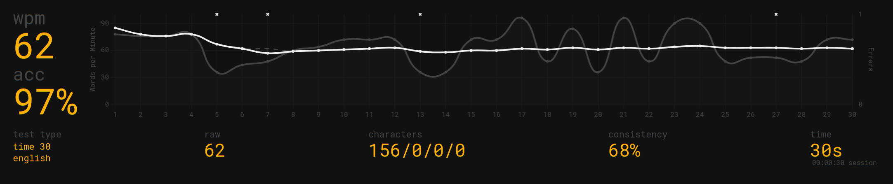

# Task completed: Terminal Velocity

- Achieved required typing speed and accuracy

- Sufficiently acquainted with usage of basic terminal commands (git, chmod, rm, mv, cp, cd, ls, etc.) and general bash usage (loops, aliases, bash profile, etc.)