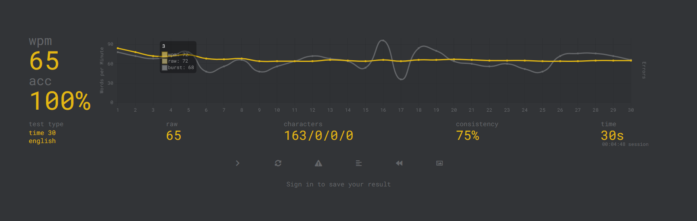

# Task 1 - Terminal Velocity

I completed the touch typing requirement using Monkeytype to build better keyboard muscle memory and speed up my workflow in the terminal.

## Typing Test Results

* **Speed:** 65 WPM
* **Accuracy:** 100%
* **Test Details:** 30 seconds test on Monkeytype (English)

Here is the screenshot of my test result:



---

## Terminal Workflow Practice

Along with improving typing speed, I practiced getting around faster in the terminal without relying on the mouse. 

Some key commands and patterns I use regularly:

* Moving around directories and checking contents:
  ```bash
  cd path/to/dir && ls -la
  ```

* Inspecting files directly from the command line:
  ```bash
  cat filename.txt
  head -n 10 filename.txt
  ```

* Searching logs or processes using pipe and grep:
  ```bash
  ps aux | grep node
  history | grep git
  ```

## Verification

Reviewers can verify the score by checking `wpm.png` included in this folder.
