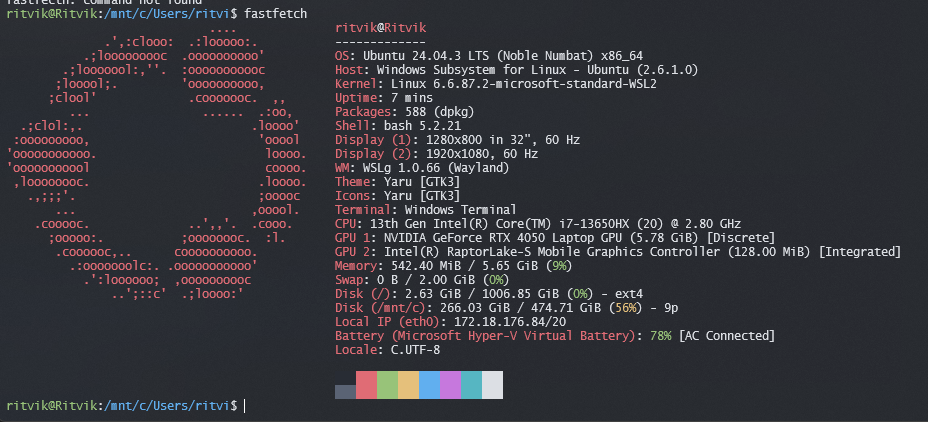

# Task 2 — Linux Migration & Environment Setup

This folder documents the setup for Task 2 (Linux Migration). Moving over to a Linux shell environment provides better control over build tools, scripts, and package managers for software development.

---

## Setup Choice

The terminal workflow was set up and verified using `fastfetch`. Running system diagnostics through the CLI confirms that everything from CPU architectures to core libraries and shell configurations are running smoothly.

---

## Quick Commands Used

Here is a breakdown of what was executed:

1. Package Refresh:
   ```bash
   sudo apt update && sudo apt upgrade -y
   ```
2. Tool Installation:
   ```bash
   sudo apt install -y fastfetch
   ```
3. Verification Output:
   ```bash
   fastfetch
   ```

All step-by-step commands are logged in [`usage.txt`](./usage.txt).

---

## Verification Screenshot

Here is the terminal output from running `fastfetch`:



---

## Submission Files

- [`fastfetch-screenshot.png`](./fastfetch-screenshot.png) — Proof of running terminal system specs.
- [`usage.txt`](./usage.txt) — Log of installation & update commands.
