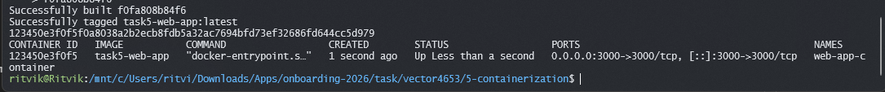

# Task 5 — Containerization ("It Works on My Machine")

This directory documents containerizing the Node.js web app from Task 4 using Docker to make sure it runs consistently across different machines.

---

## What Was Containerized

The Express backend and static assets were packaged into a container using an `alpine`-based Node 18 base image to keep the footprint small.

---

## Container Configuration

### `Dockerfile`
```dockerfile
FROM node:18-alpine

WORKDIR /app

COPY package*.json ./
RUN npm install --production

COPY . .

EXPOSE 3000

CMD ["npm", "start"]
```

### `docker-compose.yml`
```yaml
version: '3.8'

services:
  web:
    build: .
    ports:
      - "3000:3000"
    environment:
      - NODE_ENV=production
    restart: always
```

---

## How to Build & Run

1. Build the Docker image:
   ```bash
   docker build -t task5-web-app .
   ```

2. Start the container:
   ```bash
   docker run -d -p 3000:3000 --name web-app-container task5-web-app
   ```

3. Alternatively, using Docker Compose:
   ```bash
   docker compose up -d
   ```

4. Verify the container status:
   ```bash
   docker ps
   ```

---

## Verification Screenshot


